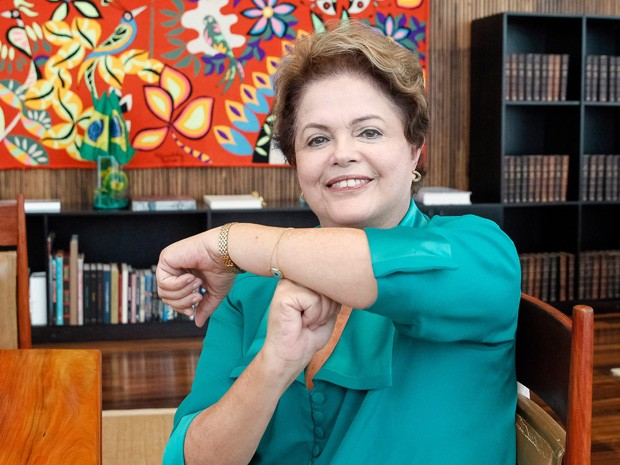

## Oi
Primeimranente quero te dizer que obrigado, obrigado por clicar num link aleatório que enviei em uma rede social minha e querer ler algo que to escrevendo. Se possível me diz que leu e o que achou, mas se não quiser também, ta tudo bem.

## Intransformismo
Então, esse titulo maluco que botei, o que caralhos é Intransformismo? E eu digo, não faço a mínima ideia, só escrevi essa palavra por quê achei ela maneira e que talvez se encaixe com o sentimento que tenho. Acho que nem existe a palavra.
Porém quero falar um pouco sobre ser e estar. 

## O que eu sentia
Sempre tive problemas com auto estima, sempre me sabotando por não me achar bonito o suficiente para o mundo. Por N traumas que passei em minha infancia e hoje tenho que lidar com isso. E uma das coisas que me fizeram lidar melhor com isso foi o ciclismo.

## Ciclismo 
Desde o ano passado, vulgo 2019 venho passando por diversas mudanças que me impactaram positivamente na vida. Entre elas esta o ciclismo e como isso foi fundamental para diversas mudanças no que o Raryson é e o que o Raryson vai ser tornar. 

Com o ciclismo e caminhadas por lugares aleatórios simplesmente para ver a paisagem e estar consigo eu fui mudando e observando as coisas de maneiras diferentes. Coisas que fui observando.

### Momentum
Tudo e todos tem um momento ou uma sincronia ou uma energia. Seja lá como você quer chamar, e isso é fundamental para qualquer relação humana e não humana.

Esses dias eu tava fazendo o exercicio de pensar o que quero ser daqui a 5 anos e o que eu queria ser 5 anos atrás. E com isso vi que eu jamais imaginaria que eu teria trilhado tantos caminhos diferentes e que jamais conseguiria pensar que a minha vida pudesser ser tão tri como ela foi nesses ultimos 5 anos.

Obviamente teve diversos pontos baixos mas foram justamente esses pontos baixos que me fizeram subir como nunca. Eu fui aprendendo que o problema não é perder, o problema é ganhar e não aprender.

### Fator de mudança
O que me fez começar essas peregrinações com bicicleta ou apé foi que eu não aguentava mais ficar dentro de casa. Não aguentava mais o Raryson que eu era e principalmente eu não aguentava mais não me fazer sentido. Então o que resolvi fazer? 

Isso mesmo começar a andar igual maluco por ai. 
Lembro que eu tinha uma rotina de sair todo sábado de manhã pra ir comprar Tilapia (O peixe aquele) e café fresco. 

Sabe que esses pequenos atos foram começando a entrar na minha rotina. E isso foi mágico. Pois quanto mais eu andava, mais eu pensava. E quando tu tem muito tempo pra pensar uma hora tu precisa lidar com a pior coisa.

Que é tu mesmo. Tu precisa te resolver, tu precisa te entender, tu precisa te aceitar.

E isso demora. Eu não me aceitei só por simplesmente começar a andar, mas começar a andar foi o **Fator de mudança** que começou todo ciclo.

### Todos tem a contribuir
Essa aqui era uma coisa que o eu tinha bastante problemas, que é deixar fluir e aceitar o que ficou de melhor e deixar seguir o que foi de ruim.

Relações sempre terão atritos, conversas e construções e eu acho isso fantástico. Pois é só assim que se cresce.

O Raryson do passado pensava que quem tinha passado pela vida dele e não tinha deixado uma coisa "Boa" merecia ser esquecido.

Hoje eu penso que todos contribuem para o teu eu do presente ser o teu melhor no futuro e que todos contribuem. Te ensinando por bem ou por mal, mas é sempre uma construção. E isso é muito legal.

### Título de placeholder pra ser misterioso
Mano, se tu chegou até aqui, espero que eu consiga te ajudar com algo com minhas palavras. É tois.

