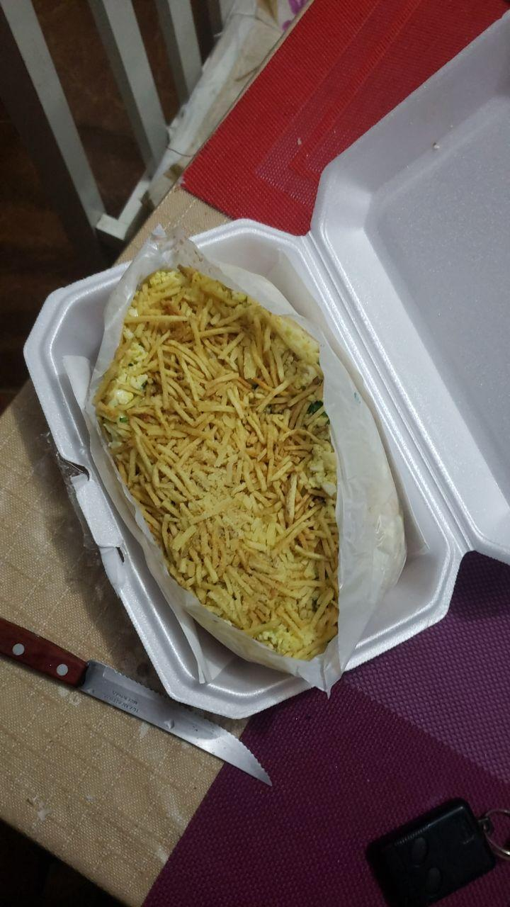
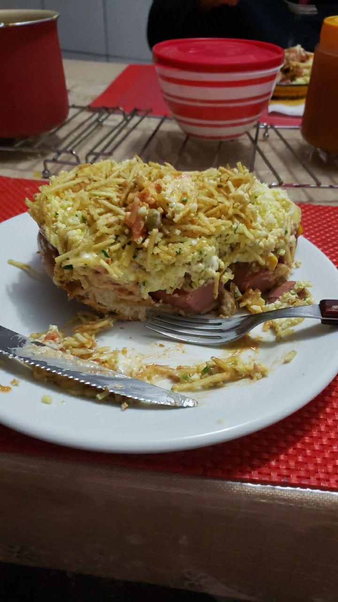

## Contexto

Eae gurizada, dibas? Venho aqui lhes contar a história do dia que comi um cachorro quente de 1kg.

Então, sábado, noite chuvosa na região metropolitana do Rio Grande do Sul, cidade de Gravataí, dia 6 de Julho de 2020, tempos dificeis, tempos de pandemia. 

Raryson e seu fiel amigo Matheus decidem se aventurar em um já conhecido território hostil. Morada do Vale, vulgo território dos maluco brabo.

## A história

Raryson e Matheus decidem fazer seus pedidos via o site (tão confuso quanto esse texto) do dogão da morada do vale. 

Raryson por engano pede 3x o mesmo pedido. Que era de **FUCKING 4 CACHORRO QUENTES DE 1 KG, TOTALIZANDO 4KG DE BOMBA DE MORTE**.

Também vale ressaltar que decidimos ir buscar o cachorro quente presencialmente, pois o restaurante em questão não faz tele entrega pra o meu bairro e quando faz é 15 conto (um absurdo). :(

Depois de ter feito o pedido começamos a jogar joguinhos na internet, visto que o pedido demoraria cerca de 20 minutos para ficar pronto, achamos ok jogar.

Depois de uma hora de espera percebi que a 45 minutos haviam me ligado no meu telefone, porem quem no século 2020 ainda liga para as pessoas? E sim galera, o cachorro quente tava pronto a 45 minutos. Depois de muito atrito e burocracia fomos buscar os dogs. Então peguei meu carro e sai metendo drift até o restaurante.

Chegando lá, pagamos, pegamos e voltamos.

## O lanche

Eu particularmente achei bem mediano, tipo, pra não falar que é ruim, por quê os caras misturam barbecue e ketchup demais, fica muito doce e só tem gosto de industrialização e morte. Então, não curti muito. 

A maionese é boa, o ovo picado é um ovo picado, meio que não tem como errar né? Mas mano, é barato, 20 pila por 1kg de dog. É bem barato, só não acho que vale a pena pelas calorias ingeridas comendo uma comida que com certeza vai te fazer mal. Eu particularmnete acho que comer um hamburgão e pagar um pouco mais é bem melhor.

Esse é meu feedback.

Olha ele no pacotinho, o tamanho da criança.

E aqui a foto dele no prato

